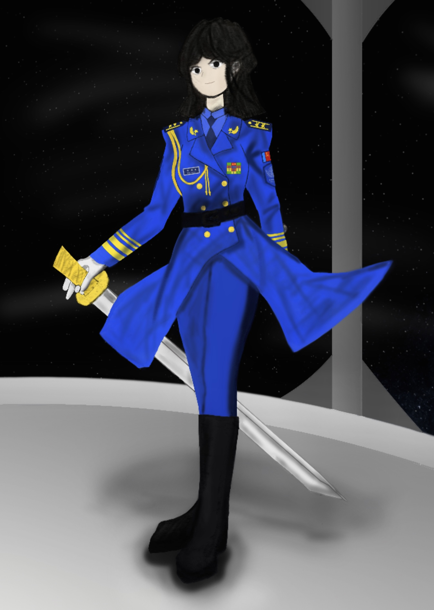

# Start of the Space Navy

"The destroyer is here..." said a lady in a Russian accent that seemed to be in her thirties, with a pair of black eyes and shoulder-length black hair, wearing a deep blue military uniform. She exited the bridge with another officer wearing a similar uniform. "Executive Officer Taguchi, what are not checked beside the bridge?" "Probably nothing left unchecked. We've walked from the engine department to the bow, and returned to the bridge here," the executive officer said.

"You have called me several times from the bridge, captain," the damage control officer hurried out of the elevator two minutes later, "Come on, man," the captain adjusted the sword sheath tightened beside her on the belt, "We are going to assemble our crew in the central hangar in half an hour as planned. I wish nothing will go wrong later. How's the main batteries and their magazines?" "All safe," he replied after swiping the pad on his left hand, "Beside possible errors that trouble our radars and fire control system. Luckily, the first month will not involve in live fire." "I see. Send the document to the portal, and I will report to the Command immediately after reaching captain room." "Yes, captain."

"Hmm...typing on this unfamiliar computer?" The captain took off her hat and opened the facility on the desk. After she finished opening the device and typing the report, she closed the thing and took of the sword--the walking sword awarded by the chairman was usually not to be taken around with her, especially during combat missions--then walked from her seat and put it on the sword shelf placed on a cabinet. She walked out of the captain room, locking the door; immediately after that, she walked to the elevator at the end of the corridor.

"This is Capt. Ariel. Attention, all crews. I repeat, attention, all crews. We will assemble at the central hangar in a quarter, please wear your dress uniforms properly. All crews should enter the hangar according to designated formations the ship command have released. Repeat, enter the hangar in formations designated by the ship command. Over."

*
A paint by unknown author, probably from a crew abroad the destroyer. The painting shows Capt. Ariel in space naval dress uniform, a naked sword in hand, standing in front of a porthole somewhere inside the destroyer's bridge.
*

Accompanied by solemn welcome march, the department officers and their crews walked into the hangar that had about ten fighters and three bombers in order. First came the C & R Department, then the Engineering and Supply Departments, which are crucial in keeping the ship alive. Later, the gunnery and flight departments--the latter never appeared in a destroyer in history--entered the hangar. Finally, the navigation department led by the captain and the executive officer walked into the hangar in loud applause from crews standing up from chairs.

"Welcome all crews who are going to spend time in destroyer DD-6," the executive officer stood behind the podium, "I am the Executive Officer and Navigator of the ship, and my name is Kenjiro Taguchi. Let's welcome first officers on the ship." After those of all departments stood on the temporarily set platform, the captain stood onto it last of all, with thundering applause from below.

"...We are born in the same era and have fought for integrity and safety of our homeland, Earth. We also studied and trained hard to enter such positions that defend aerospace of our home and space within our Solar system, and it is lucky for us to gather and meet in DD-6, which will receive her first name in a month or so. Thus, we should not let our surface forces and our people down, and we should move forward bravely regardless of what obstacles are!" As she bowed to hundreds of crews, another applause roared in the hangar.

On February 19th next year and on any other seven destroyers and three "capital ships" (which I mean the cruisers), as well as auxillary ships including satellite sweepers and some escort freighters, enlisted thousands of officers and crews joined assemblies on their ships for establishment of the Solar Space Navy.

"I got the report from the Command," said the captain to the executive officer, "They will replace them within a week." "Quite good...maybe. What type of radar will be?" "Perhaps the current type that can detect targets in 9 spatial miles," she replied as she viewed another page of instruction. Suddenly, a figure appeared in the holographic communication platform. "Fleet commander." The captain adjusted her cap and saluted. "What is the order?" "The Command orders an instant gathering of all eleven ships in the 1st and 2nd fleets for the first drill. Move to the designated position immediately and follow the plan." "Yes, sir."

"Is the commander Manfleid Tenant?" Taguchi asked the captain. "Yeah," she replied after opening up the displayer, showing a cross somewhere below an incomplete circle labelled as "Moon". "He was the former captain of CL-1, who managed to dodge dozen torpedoes, all missiles and bombs dropped from surface force aircrafts. He is a brave man as I hear from seniors." "Alright," the captain cleared her throat, sat in her seat and said, "Man battle station!"

Immediately, the executive officer sat in his seat and started the engines by pressing some buttons. As he moved the lever, the captain and some standing officers--some were jockeys, others were radar officers--clung themselves to bars in front of the controls tightly. A strong pushing force brough the ship parking in the shipyard into the outer space, passing the cloud layers, the blue mesosphere, eventually entering the exosphere with thin sky blue air descending into black space illuminated by glim light from stars.

"All crews, we have exited Earth atmosphere. Now we enter alert level 1," said Taguchi while continuing maneuvering the ship into the space, "Please make sure all facilities and shipboard artillery function well, and report any error immediately." "What is the altitude now?" The captain asked. "363 km relative to sea level, increasing at around 1 km per minute." "The ship should be sailing horizontally once we reach 370 km, and maintain 2/3 speed." "Acknowledged."

"The Command notes that there may be possible contact with 'enemy' bombers, although we still lack a functional fire control radar, we still need to separately use our main batteries to 'defend' ourselves!" The executive artillery officer said in the back of the bridge, where a screen displayed the ship shape. "Ship detected," said a jockey, "Perhaps one of the light cruisers. At a bearing of 320 degrees, 11 spatial miles." "Which light cruiser?" The captain asked. "Send a report to the cruiser."

"CL-1's report." Some seconds later, a signalman said. "Avoid it and move at her starboard," the captain said, "We are defending the cruisers." "I see."

"This is the command," as the ships formed three trapezoidal formations, the broadcast rang inside the bridge, "Please prepare for the drill for fleet anti-spacecraft defense. Now, all units, move in a fleet speed of 33 spatial miles per hour at a bearing of 175 degrees." "We are going to encounter enemy bombers?" a crew asked. "Yeah," Chen Dayou replied, "Who knows what our blue bombers will drop and what they will be. They may knock a small hole in our turrets or tear off our bridge in real combat. We had better be careful in the drill."

"They have entered the position," said Wendy as she looked at the radar, "They are getting farther from Earth and the Moon." "Order our bombers in the 1st and 2nd Air Groups attack in order when they are 30 spatial miles from both the Moon and Earth, where our surface forces cannot provide spatial cover," said Lin Qi as she switched pages on her computer. 

"Tim Nordberg from Squadron 1 reports," the pilot pressed the buttons and dozens of planes took off from airfields in Mars following him. "Wedge, remember the order of attack. Good luck."

"Blue team bombers approaching!" shouted a jockey as he glanced at the radar. "Order to fire our main batteries if necessary, Eroshenko," she quickly ran to the gunnery firing command where the executive gunnery officer and other crews were looking at the radar. "Where are they?" "8000 meters above," the executive gunnery officer replied. "Try if the main batteries can fire at them." "Fire all main batteries!" The executive gunnery officer shouted. With a slight shake, the eight main batteries fired eight laser beams into the space, exploding high above the warship. "Flank speed!" The captain shouted, "Escort the flag ship first!"

The captain quickly moved back to the displayer in the middle of the bridge connected to the radar. "They seem to start a horizontal bombardment!" She said to Taguchi, "Right Standard Rudder!" Just then, sirens of missiles rang--unlike past horizontal bombardment, missiles launched from bombers high above were used to take down warships' external sturctures. "Direct the firepower to them!" Just then, the radar showed one missile shooting close towards the deflector shield generators, but no explosion was simulated.

As the red points began to disappear, the gunnery officer shouted: "Around 30 enemy bombers approaching!" "Captain, CL-2 reports loss in their deflector shields!" A signalman ran to her and said, "And DD-3 was badly damaged in frontal main batteries!" "Send a telegram to CL-2!" The captain quickly replied. "The CL-2 replied that the ship structure was not severely damaged." "Thank goodness!"

All firepower was pouring laser beams and missiles into the space as dozen bombers were flying above and preparing to dive. "Left full rudder!" The captain shouted, "They are dive bombarding!" Just then, the system simulated two bombs dropped from bombers exploded at port and starboard of the second main turrets, resulted in near misses. "Cabin 114 and 115 are damaged!" A voice rang in the bridge. "Dayou," the captain quickly replied after telling Taguchi something, "Seal them immediately!"

Then, the system reported that one bomber was "shot down" by them. "They may be moving away," said the executive gunnery officer, "Who knows whether there will be a second wave." "The flagship's telegram," said a signalman in the bridge, "CL-3 is badly damaged in main batteries and now suffering from induced explosion in frontal main batteries!" "What the heck?" The captain was surprised, and she adjusted her cap and said: "Cover our flagship as always!"

Just then, a jockey shouted: "Another tens of bombers coming in from the west, at a bearing of 290 degrees!" "Left standard rudder!" The captain shouted as she saw the radar screen. "They are going on torpedo runs!" The captain said to the navigator, "Maintain flank speed!" Just then, several torpedoes--which left trails of deep blue while moving, were like floods penetrating any barrier. "Slow down to fleet speed!" Around the moment, two torpedoes just rushed past the bow without stop. "One bomber has been shot down!" Eroshenko shouted. "If we had a functional fire control radar, we could have done better."

"Right full rudder!" As the captain shouted, the executive officer pushed the rudder hard. Three torpedoes, moving in different pathways, were avoided. Suddenly, an officer shouted: "One torpedo heading towards middle starboard!" "Brace!" The captain immediately shouted. All crews in the bridge quickly clung to something and held their heads. However, as seconds passed, nothing happened. "Captain, this is the damage control group," said a voice in the broadcast, "The torpedo flew below the bottom and did not explode at all." "Thank goodness," the captain relieved her breath.

"Comrades," another voice rang in thr bridge, "This is Command. We have accomplished the drill. Please return to the Headquarters in Mars immediately, repeat please return to the Headquarters in Mars immediately. Keep the contact on, and the surface forces will permit you in once receiving the code. Over." "Thanks," the executive officer replied, "This is DD-6, returning immediately halfway."

"How many planes have we shot down, Eroshenko?" The executive officer asked and typed some codes. "I don't know the exact number, but we definitely got three or four. Just see how the Command determines," the gunnery officer walks to the center of the bridge. "If the fire control radar had been replaced, we could have shot more." "Come on, man," the First Lieutenant that just arrived the bridge said, "If we hadn't been lucky enough, any torpedoes could have torn the ship in reality."