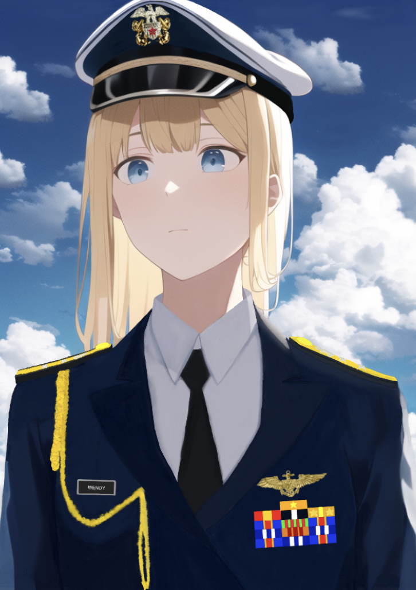

# The Final Report

After the return to the Solar system, the commanders of the vessels finally saw the large Sun, shining brightly in the space. Compared to the relatively dim Proxima Centauri and the two other large suns in the middle of the stellar system Alpha Proxima, this large star looked more familiar for them.

"The Command asks us to summon individual report for the drill, and we the commanding officers, should come up with that in around five days," the captain scrolled down the page on the digital computer and said, "My experience will produce a much more different one, I can firmly promise." "You mean that we will be surely overwhelmed by those aliens you are constantly mentioning?" asked Dayou. "Yes, and no. We will see. I hope every commanding officer come up with individual reports, and I will summon them up." "Yes, captain."

"...That is just so real, I mean, the drill," Anya drank a whole cup of water after seeing the navigational waypoints appear on the screen, "Very scary." "So, what are you going to write about? The overwhelming priority of those 'alien' bombers?" The air officer said, "Our fighters are almost decimated by them, no, their escorts and defensive firepower." "I am going to tell you about it in the meeting later."

......

"Admiral Lavillia," a vice admiral pointed at the holographic screen, "The imperial fleets are advancing in the northeast of our country." "But we have placed one full battleship formation, two destroyer squadrons in Coruscant's outskirt space to defend any intruders from the western parts of the country that had been occupied," said the admiral, "The rest two battleships, two cruisers, and the other destroyer squadrons are mobily stopping their advance in the eastern front."

"They seem to have increased the strength to fortify their established territories in the north and east frontlines," another vice admiral said, "I do not expect striking back in the southern front." "But enemies have halted right before reaching the southwestern borders of their former Debris Pass Military District, and our fighters stored in adjacent systems can cause great trouble."

"Their anti-spacecraft weapons cannot produce significant firepower to stop imported bombers," a rear admiral replied, "So, I will keep defending there until retreat orders issued." "Thanks. Be careful of their bombardments by their vessel main batteries," the admiral said, "They are bombarding hundreds of times every day in reachable stellar systems near the frontlines." "Therefore, we must do something to stop their advance." "They are diverting battleships in the north to the northeastern front," continued the admiral, "Wait for further deciphered intelligence."

"I can judge that they are running out of vessels to fight in this large scale of spatial war after their expansion on multiple fronts," the vice admiral said, "My section received fewer satellite destruction reports since this month." "Keep up the good work," the admiral smiled, "The longer time we hinder their attacks, the faster the anxiety in the enemies will spread."

......

"You sure about putting the two backup fleets in the Sixth Group Army in the attacks in the northeast?" The marshal questioned in a serious tone. "Without them, you can't just seize the stellar systems, like those with an asteroid belt, such as Obregon, to starvation!" The admiral replied in a similarly serious tone. "We cannot be stuck again! After rebels temporarily retook Mendoza, we were criticized by the Emperor for reacting slowly. This time, we cannot repeat that."

"We are all ready to land, even crash land those stellar systems for seizing complete control," a surface force marshal said to the marshal, "And..." "We can't waste lives, generals!" The marshal raised his voice and said to all others standing around the holographic display table. "The Emperor has given us four group armies with backup from the Imperial Central Army led by the Central Province itself. They are depending on our commands to succeed!"

"But what about those surface force soldiers?" A surface force general of the army asked the marshal, with his eyes staring on his. "You, as a marshal who fought the two brutal wars for the Empire, from an unknown lieutenant to then space navy admiral, clearly know that! We have to suffer from bombardment of the counterpart surface forces, as well as bombardment of spatial vessel! We have suffered greatest casualties than yours, just because of ineffective convoy!"

"I definitely understand!" The marshal said in a more serious tone, "You know what is happening to the Space Navy, right? As an experienced commander, I have witnessed warship torn apart by enemies in many means, seeing my soldiers dying in space with no intact remains! Let's just focus on the attacks!"

"I have to question your ability in conveying our freighters, Marshal Dmitry Fyodorovich. Many of our vessels have been sunk just by their surface aerial or carrying spacecraft bombardments! I am just at the edge of being questioned by the Ministry of Defense! Therefore, my request for drawing back up fleet can be justified, and must be done so!" "Yeah, marshal," a Space Navy vice admiral also protested, "The Imperial Central Army is just watching us with no available help, and the National Guards dispatched by it are just wandering in the occupied zones."

"Don't you remember what the old marshal said, Marshal Dmitry Fyodorovich?" An admiral turned to this man whose hair was visibly white and face was full of wrinkles. "In his ninetieth birthday celebration in which the Emperor went in person, the old marshal, who was one of the last three alive marshals in Wilhelm II and Fyodor I, talked many about integrity, which we lack greatly in the operation. Luckily, he had passed away last year; or else, he would be killed by heart diseases caused by the hypertension."

"Yes! You see, marshal," another admiral said, "The Second Group Army is just literally watching us confronting Coruscant after two flagships of their fleets had been sunk just solely by the spacecrafts. Whenever we tried to bombard the facilities on the ground, they never provided sufficient fire cover! I have stressed that at least thrice in the monthly reports."

"Alright, alright!" said the marshal in a helpless tone after shaking his head several times. "Let's just focus on the current offensive in the northeast, and I will talk with Marshal Francis Ivanovich about the final report on the first phase on this military operation!" "We will, dear marshal." All generals replied simultaneously.

......

"Oh my...," exclaimed Dayou, "What type of words are you using in describing us, my dear alien comrade?" "I am trying to be objective," the captain, wearing the normal uniform, replied him in a helpless tone, "Because I just cannot see clear signs of victory in this type of combat. Well, even though we can organize a small escort fleet, we can't fight multiple battles in which they have absolute priority." "Will you reveal the war raging inside your country to rest of us, no, the whole peoples around the globe?" asked Dayou who was standing beside, watching the computer.

"That war? What if I describe it to the Winter War, Russo-Ukrainian Conflict, or American intervention in Israel?" The captain replied in a wry smile. "What do you mean, Ariel? Do you mean that they halted despite having some overwhelming advantages?" Eroshenko replied. "Yep. They are hanging around most border areas and the capital, and doing nothing further." "So, will you use the offensives or defenses done by the belligerents?" "Not directly. I have another plan before the implementation of Martial Law at the end of next month, on July 23."

"Why are you so concerned about the military administration?" asked Mikhail, "That on Hapsaha will last for at least two years, but that on Earth follows what we call as 'Mandatory Bill' that grants the Security Council to implement the Martial Law." "Can that be extended?" "We have to see how the General Assembly votes, but trust me," said Mikhail in a strange smile, "After our reports to the representatives, they will vote for 'yes' unanimously."

"Turn back to the topic, the final report," said the captain. "No need for elaborating on Medical and Pathological Information section, and Fire section, and...what do you think about the Survival Aspects section?" "I will just say that it is nonsurvivable for a crew with average steering skills," the air man said, "Our fighters found it very uneasy to intercept them, and you can just use my analysis on the bombing run to show how it is impossible to remain mobile."

"I don't fully agree," replied Dayou, "If we can organize that ejections..." "But that is useless for our combat," Eroshenko argued, "I just feel that we fired out everything, and we eventually got nothing out of it. If we can't intercept them, and chase them away, just by dodging the missles or bombs or torpedoes we can't stand a chance. You are right on that, Müller."

"Alright, put that later," the captain said, "I just feel the overwhelming disadvantages we have if we are in combat. Skip to the Analysis part. I will spend most of the remaining days on it. Be prepared for staying up late, comrades."

......

"Yes, confirmed. There is just one month before the voting on extension of the 'Mandatory Bill'," said the Chairman. "I just wish that extension not to happen, but...I think the reports given by those captains will show it impossible, right, Wendy?" "Yep. This problem is the most difficult one I have handled. If the population after the war hadn't been reduced drastically, I wouldn't have been pushed to this position at such a young age. Now I know how uneasy your generals are."

"We will have to be neutral, as the senior members of the Security Council, anyway," the Chairman replied, "I know. Young and middle-aged generations about one century ago suffered greatly. If those aliens come, the suffering will be much worse. Just watch the captain providing the final reports and let those representatives decide. Of course, the military administration in Hapsaha should remain as planned until interruption fron aliens."

"Prepare to be shocked by facts or analysis made by those captains, Chiefs of Staff. I am as well."

I still remembered that day which I decided to interview her at the bridge of this outdated cruiser. Though never young anymore, her elegance as a retired military general still remained in her face and her tone of speaking. During the part about the extension of the military administration, she said a setence that I still remember clearly: "With weapons, you may starve; without weapons, you will starve."

As the interview finished, she gave me a small piece of drawing of herself.

*
AI recreation of a photo of Wendy, the former Chief of Staff of the Security Council. She was bearing the American shoulder mark for rear admiral and wearing the modified American Full Dress Uniform in postwar periods. Many young officers at her time got promoted fast in resolving postwar conflicts.
*

The drawing is a small piece recreation of an abandoned official portrait of herself around a score of years ago, the time near Korean reunification. From her words, the original picture was taken around San Francisco during an inspection of postwar reconstruction. It was how unimaginable, for me, that this young lady then worked as the political commissar of the 1st Fleet during surface force repulsions to early alien attacks in Israel. Afterwards, she was promoted to rear admiral.

Without these hard copied images, we may have no idea how our past was despite the existence of holographic technologies. Just like Earth, what remains solid as hard things is the real power of its development; and at the time where turmoil was at the edge of spoiling into the Solar system, what generals like her were doing was to preserve our population for a future full-scale global war, which it really took place again, but facing a different enemy.