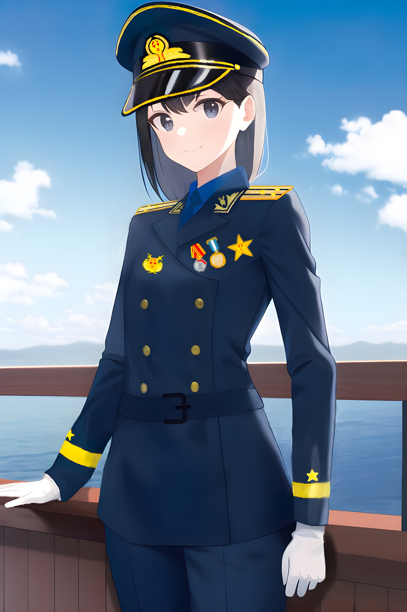
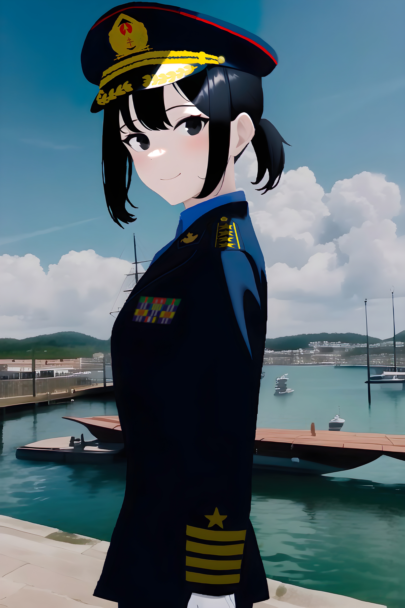

# The Shockwave

After attending the ceremonies on July 1, the Chairman put off his ceremonial uniform for a brief rest in his office room. Just after napping for 10 minutes, someone was knocking his door, making him immediately awake. "Enter...enter the room please," the chairman said.

"Ah, Wendy. I just napped for a while, since it is at noon here." "Alright. At 1:30 pm we will be hosting the Joint Session of the United Nations as regulated in accordance with the Mandatory Bill. Just a kind reminder one hour before." "Will you sleep for a while? We have been viewing their final reports for the days being." "Never mind," replied Wendy, "I don't feel much better. If possible, I would request the General Secretary to postpone the meeting and sleep."

"He isn't much better. He just held consecutive conferences for the ceremonies today last month, as well as reading those reports from the captains." "He can read them?" "Yep. Born in years right after the war, many of those postwar conflicts were solved with his participation." "Well, then I will return at 1:15 pm and wake you up." "Sure."

With Wendy exiting the room and closing the door, the chairman fell asleep in about two minutes. Then, he heard noise of something hitting the nearby things intensely, finding that the room had been much darker in surprise in a glimpse. "It is raining," he whispered, and surprisingly saw the thick layers of dark clouds through the window, which had been hit countless times with walls of rain.

Immediately after seeing the clock, he went back for rest until the door was knocked.

......

In the reconstructed General Assembly that could hold approximately one and half thousand delegates, including seven and eight ones for a delegation of a country, with the rest provided to the Hapsaha delegation. Since the age of Lunar and Martian exploration, another fourteen seats had been arranged for degelations from Mars and the Moon equally, consisting of leaders from Five Permanent Member States and two other places.

After a welcoming ceremony, the chairman briefed the situation since June 5 last year. As the applause that followed it faded, Wendy continued as the hostess: "Let's welcome the representatives from the military to brief the situation and the recent weaponry research conducted by the Space Navy."

No one would realize that this meeting would produce subsequent shocks during the next whole year.

As an examiner of the AI recording for the Joint Session, I was monitoring and correcting recorded words shown from the AI system with seven other colleges. During the first session, which was provided by captains from the First Fleet, most of them mentioned things like "increase in onboard firepower" "radar surveillance improvement" "fire control" and things typically saw in historic naval engagements.

Then, as Wendy said "Let's welcome Commander Ariel Lyudmila of destroyer Snowy Wind in the Second Fleet to brief her research report", the normal atmosphere turned drastically. Sitting at the recording seats, none of us, and even those applauding in their seats, never realized the consequences of her speech.

*
AI sketch of Ariel's official portrait. She was bearing the Russian rank for Captain after promotion, and wearing the Russian version of the prototype Space Navy uniform of our country. Medals on the uniform were Medal of Friendship awarded by the UN General Assembly, the Order of Lenin awarded by Russia, and the "For Defense of the Country" awarded near the end of the Interstellar War.
*

"Look, she is about to say something," replied Commander Anya of another destroyer Kuznetsov to the nearby Air Officer in another destroyer. "Isn't the captain an alien?" "Yep. Don't worry," Anya replied, "At least they have the intention of helping us."

"...The manufacturing capabilities of the shipyards are not sufficient to counter the possible losses...Previously we have conducted multiple simulated drills using the available vessels and spacecrafts in the simulator system, it is true that we have no problem of defending our stellar system. But the drill conducted earlier in June showed that if put into the scale of the war in my country, our Space Navy will be decimated in one single combat." Just before continuing, voice of rumors were filling the General Assembly hall.

Without our realization, many generals and senior officers had been already frowning when the briefing went halfway.

"What was her last spoken words?" I asked a colleague. "Emm...I though it was 'one such...', but there are so much noise outside that the system marks it as unintelligible. But what did she say?" "We can't fight the scale of battles in her homeland." "What homeland?" A colleague asked me. "I don't know!" I replied, "We never know where she comes from, except those words about other civilizations taught inside our lectures."

"Calm down, comrades," the Secretary General rapped the hammer and said, "Please be quiet!" The noise from the seats finally settled down after a minute. "Please proceed." "Based on the conducted research after the drill, it is impossible for us to combat the Space Navies held in other countries in the..." Noises were emerging again, eventually bursting into fierce questions and shouts.

"What are you talking about?" I could still recall one general or senior officer shouting out. Then more followed: "Are you questioning the leadership of the Ministry of Defense?" "Calm down, comrades!" The Secretary General slammed the hammer and nearly shouted. One minute later the conference room quieted down again. "I know it is very controversial, but please remain your questions to the end! Respect our comrade! It is near the end!"

"It is undoubtedly shown that by the current strength, our Solar System can't fight the battles on our own." Despite the noise at the seats, the briefing still went on. "Therefore, the current plan for vessel construction has to be overhauled for any possible conflict with those massive civilization! Once my country falls, the Solar System will be the next victim! But, I firmly believe and promise that, we, and my country, will not lose in front of them!"

Immediately after the end of the speech, rumors turned to shouts, then ultimately turned into angry questions. "Are you insane? What the hell country do you belong to?" "You think that our bombers cannot take down their fleets by experienced pilots? Where do you gain such confidence?" "Are you making up the whole threat to control our whole Solar System?" From the camera footage, even the Hapsaha representatives, which are also victims of the imperial expansion, devided up and argued for a lot while.

"Calm down, comrades! Calm down!" The General Secretary said, while slamming the hammer hard onto the table for nearly another minute. As Ariel walked back to her seat, many officers and generals she walked past by stared at her.

"Why the masses of the representatives are opposing the briefings by her?" asked Anya to a nearby senior officer from another destroyer. "I don't know why," the officer replied, "We have been directly threatened by the aliens and sustained damage from them, now we are forgetting the pain again? Is that what communists should be?" "People are all the same, I should say," the political commissar of the destroyer turned back and whispered, "It is human nature, regardless of being under any system."

"Don't feel to ashamed," Chen Dayou comforted, "It is sure. I am sure that not many senior officers are feeling very optimistic about a sure defeat. At least I am not one of them." "Trust me please," the exhausted captain sighed and swallowed a whole glass of water, "I am assuring you as a trustible veteran and comrade." "But you are living under pressure from an external invincible Space Navy for years, we are not," Eroshenko said. "Now we have tasted it, but most of humans? Perhaps the postwar reconstruction made them forget about the seriousness."

"Who..." "The next captain is about to come!" "Who?" "Commander Anya," Mikhail said, "Your old friend. Perhaps the sole human senior officer who won't bother talking with aliens for hours."

As the middle sized, middle aged commander who shares about the same height walked to the stage, another wave of overwhelming applause rang in the conference room. At least for the time being, she was still "our man" for most of the others present.

*
AI recreation of Anya's official portrait. She was bearing the Chinese rank for Senior Captain and wearing the unified version of the Space Navy uniform during her service in cruiser Leningrad, a heavy cruiser in the early Solar Space Navy that luckily survived under her command till her retirement from the Space Navy of the Liberation Force. In the unified Space Navy, the differences in nationality are not directly shown from armbands or shoulder boards. Her rapid promotion from a commander to a senior captain was contributed the Interstellar War.
*

"Comrades. Before the briefing, during my service in the last five months, I clearly realize the threats of other alien interstellar countries into the stellar system, like many others here. It has been a serious issue since the end of the Virus Crisis last year; therefore, upon taking command of the Space Navy that the Hapsahan comrades have granted us, we conducted a drill over the current formations using the most advanced spacecraft striking forces available."

"The results, as shown above, clear showed one-sided victory for the blue side, which consists of all five escort carriers given and commanded by Hapsahan comrades. Given that their commanders and the piloting personnel are the among the best of us, the scale of destruction of our Space Navy will be much more unimaginable when those civilizations that Ariel had mentioned earlier."

Then rumers were again spreading. The chairman slammed the hammer three times and cleared the noises.

As her briefing neared the end, she said in a serious tone: "As perhaps the most solid frontline against any further alien invasion, the Space Navy's existence can not only be an active fleet, but also be a fleet-in-being. As long as we have human resources onboard and under pretection, the enemies will always consider before attacking and capturing us. We will always be victories in any perspective!"

After the applause, the commander requested the chairman for allowing spectators to raise questions. The previous commander of cruiser Beijing asked: "Why are you so firm that we will always win? And, if so, what is the cost?" Many others followed the question in similar manners. "Chairman Mao once mentioned, 'Weapons are an important factor in war, but they are not the decisive factor. The decisive factor is people, not physical weapons'. As long as any human beings is capable to fight off aliens, we will win. Even if, in the worst case, we withdraw our Space Navy to regions unknown or in Ariel's country that have not been occupies, the strength in the Space Navy, and massive scales of our reserve personnel and paramilitary forces, will keep on fighting and prevent them from fully taking control of our motherland."

Applause followed her end of speech, then an admiral asked: "Then, what is the cost? If we abandon the Solar system with our Space Navy, or align with Commander Ariel's country to combat those invaders?" "I can't say much about the matter of politics as a military personnel," Anya replied, "But I should reiterate that the costs can be great, as I have shown in the estimation--approximately 60% of the population on Earth and Mars are at risk. In the previous conflicts, we have lost approximately 25% of the population, even after decades of recovery in last century. It is indeed, risky I should say, to use only five billion population to combat a large interstellar country with many stellar systems. Even though they can trample over the Solar system, we can start a new life at an unknown stellar system and continue the civilization."

Silence followed her reply, as many officers, crews, and generals were stunned. None of us at the recording station survived the stunning words. No one, even someone like any of the Secretary Generals of the United Nations or the Chairmen of the Security Council in history, had spoken words concerning the lives of billions of people in the Solar system; the real shock was that a commander just poked the fact out. This fact, which no one wanted to experience and wanted to think of, finally happened exactly 370 days later.